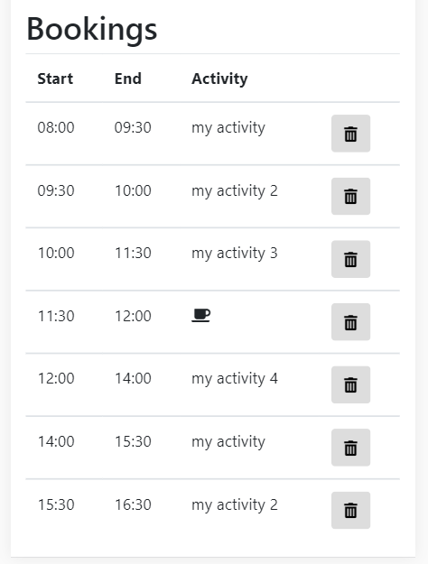

# Trax
Trax is a tiny time tracking app for private usage. It can be deployed over a docker container (see below).

## Usage
When opening the web app the overview for the current day is opening up. On top the navigation buttons can be used to switch to different days.

At any time it is possible to create activities.

On the overview page you can book time for any activity you like. The creation wizard is designed to book time very quickly.

The overview table at the end of a successful day:

## Setup
Go to `trax-angular1-springbootbackend-jpa` directory and build the project with `gradle`. Then you have two options. Either you feel lucky then you can run the application with regular spring boot means. Or you can deploy the application over docker. If so then navigate to `trax-angular1-springbootbackend-jpa-docker` directory and execute the `build.sh` script which creates a new docker image. Afterwards run a new container with the image (or alternatively execute `run.sh`)

## Technical setup
The technical setup is:
* Backend: Spring Boot with HSQL embedded database (A different database can be configured with different gradle dependencies and a different JDBC url which can be configured over environment variables).
* Frontend: Angular JS
